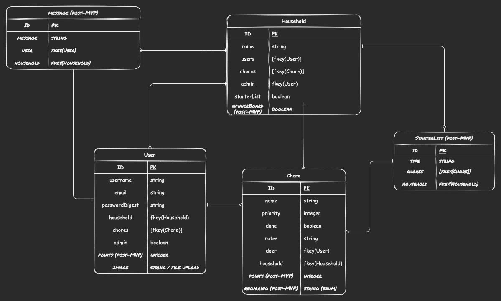
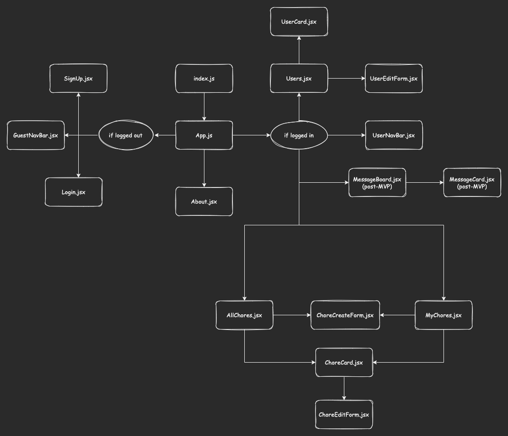

# Chore Chart
## Date: 2/6/2022
### By: Benjamin Peck
#### [GitHub](https://github.com/benjaminobambino) | [LinkedIn](https://www.linkedin.com/in/benjaminlpeck/)
***
### ***Description***
#### **Problem #1:** Whether you live with your family, with roommates, or by yourself, keeping track of household chores can be a nightmare. This causes strain on relationships and other areas of life.
#### **Problem #2:** Too many productivity apps take away from productivity.
#### **Solution:** ***Chore Chart*** keeps your chores organized and up-to-date, so you can keep chore-expectations mutually understood, well delegated, and on target. ***Chore Chart*** can&rsquo;t do your chores for you &hellip; but it comes pretty close.
***
### ***Technologies Used***
* PostgreSQL
* Python
* Django
* React
  * Browser Router
  * useState
  * useEffect
  * useContext
* Node
* JavaScript
* Axios
* CSS
  * Flexbox
  * Grid
* HTML5
***
### ***Getting Started***
#### A Trello board was being used to keep track of development progress. It can be viewed [here](https://trello.com/b/SIpmHD30/chore-chart).
#### The project will be deployed and able to be viewed on [Heroku](https://www.heroku.com/).
#### Simply create an account, log in, and enjoy a smoother chore experience in your household.
***
### ***Screenshots***
#### Entity Relationship Diagram

#### Component Hierarchy Diagram

<!-- #### Submit New Jokes
 -->
***
### ***Future Updates***
- [ ] Add user's liked jokes component
- [ ] Add joke flagging functionality
- [ ] Add functionality to minimize or eliminate repeated jokes
- [ ] Add joke search feature
- [ ] Add user's contributed jokes component
- [ ] Mobile-friendly design
- [ ] Add joke categories
<!-- *** -->
<!-- ### ***Credits***

##### Happy Dad Image: [Pinclipart.com](https://www.pinclipart.com/)

##### Laugh Icon: [tulpahn](https://www.flaticon.com/authors/tulpahn) from [www.flaticon.com](https://www.flaticon.com/)

##### Sad Icon: [Freepik](https://www.freepik.com) from [www.flaticon.com](https://www.flaticon.com/)

##### Jokes: Everyone who has ever told me a joke -->