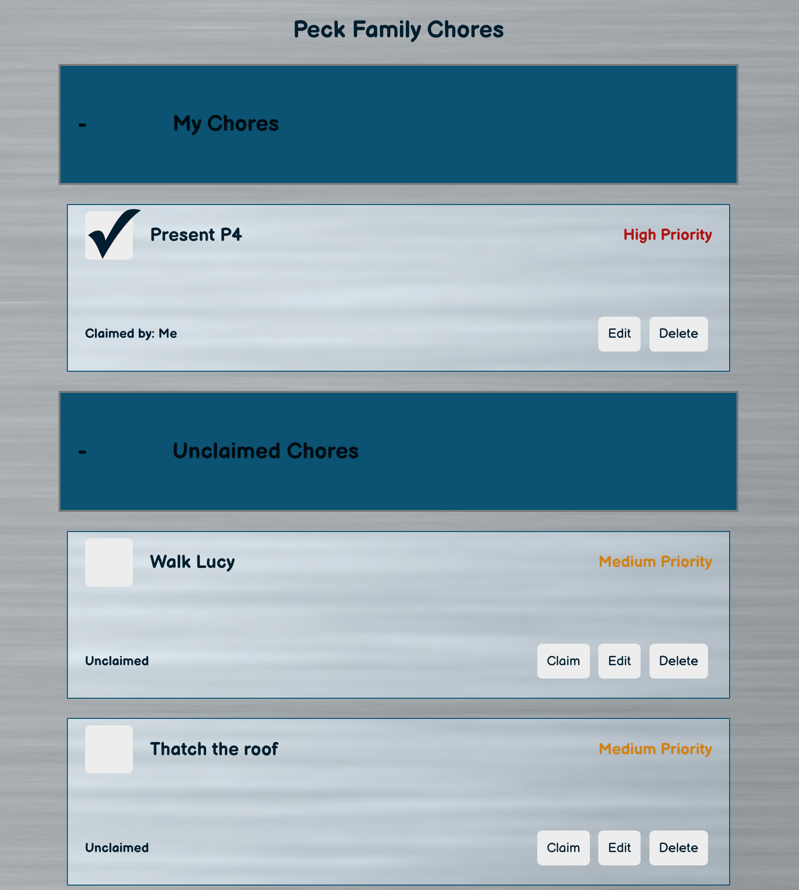
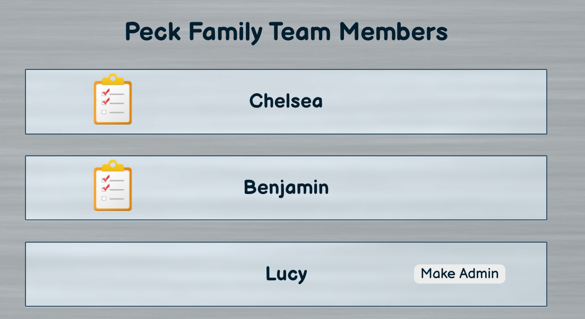

## Date: 2/14/2022
### By: Benjamin Peck
#### [GitHub](https://github.com/benjaminobambino) | [LinkedIn](https://www.linkedin.com/in/benjaminlpeck/)
***
### ***Description***
#### **Problem #1:** Whether you live with your family, with roommates, or by yourself, keeping track of household chores can be a nightmare. This causes strain on relationships and other areas of life.
#### **Problem #2:** Too many productivity apps take away from productivity by keeping users in the setup phases for too long.
#### **Solution:** ***Chore Chart*** keeps your chores organized and up-to-date, so you can keep chore-expectations mutually understood, well delegated, and on target. ***Chore Chart*** can&rsquo;t do your chores for you &hellip; but it comes pretty close.
***
### ***Technologies Used***
* PostgreSQL
* Python
* Django
* React
  * Browser Router
  * useState
  * useEffect
* JWT Auth
* JavaScript
* Axios
* CSS
  * Flexbox
  * Grid
* HTML5
***
### ***Getting Started***
#### The project backend REST API has been deployed on Heroku with the frontend on [Netlify](https://chorechart.netlify.app/).
#### Simply create an account, log in, and enjoy a smoother chore experience in your household.
#### A Trello board was used to keep track of development progress. It can be viewed [here](https://trello.com/b/SIpmHD30/chore-chart).
***
### ***Screenshots***
#### Chore Component with Chore Cards

#### Household Component with Profile Cards

***
### ***Future Updates***
- [x] JWT Authentication
- [x] 3rd party API for inspirational quotes
- [ ] Recurring chores feature
- [ ] Chore point value and weekly winner
- [ ] Message board
- [ ] OAuth
***
### ***Resources***

##### Django Documentation: [Django Documentation](https://docs.djangoproject.com/en/4.0/topics/auth/customizing/)

##### Simple JWT Documentation: [Simple JWT Documentation](https://django-rest-framework-simplejwt.readthedocs.io/en/latest/)

##### Very Academy: [Very Academy](https://github.com/veryacademy/YT-Django-DRF-Simple-Blog-Series-JWT-Part-3)

##### Checklist Icon: [IconArchive](https://iconarchive.com/)

##### Background Image: [A&W Maintenance Inc.](https://awmaint.com/a_w_logo/)